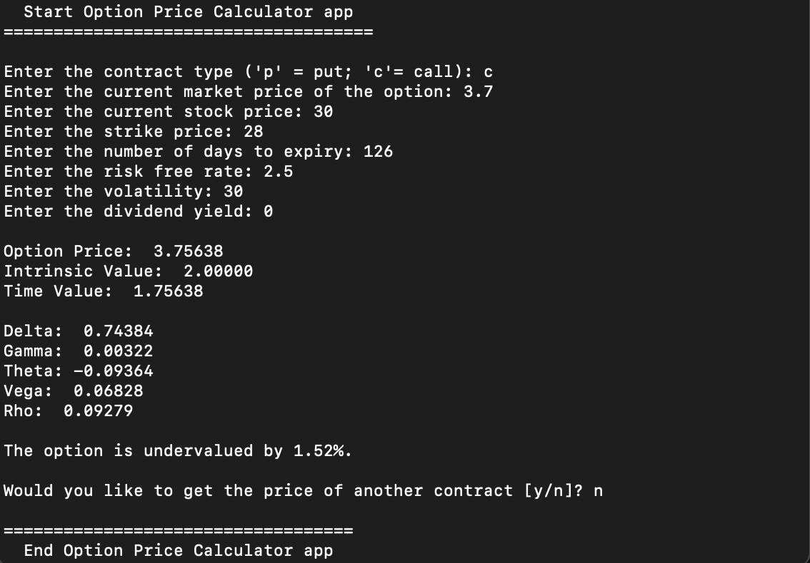
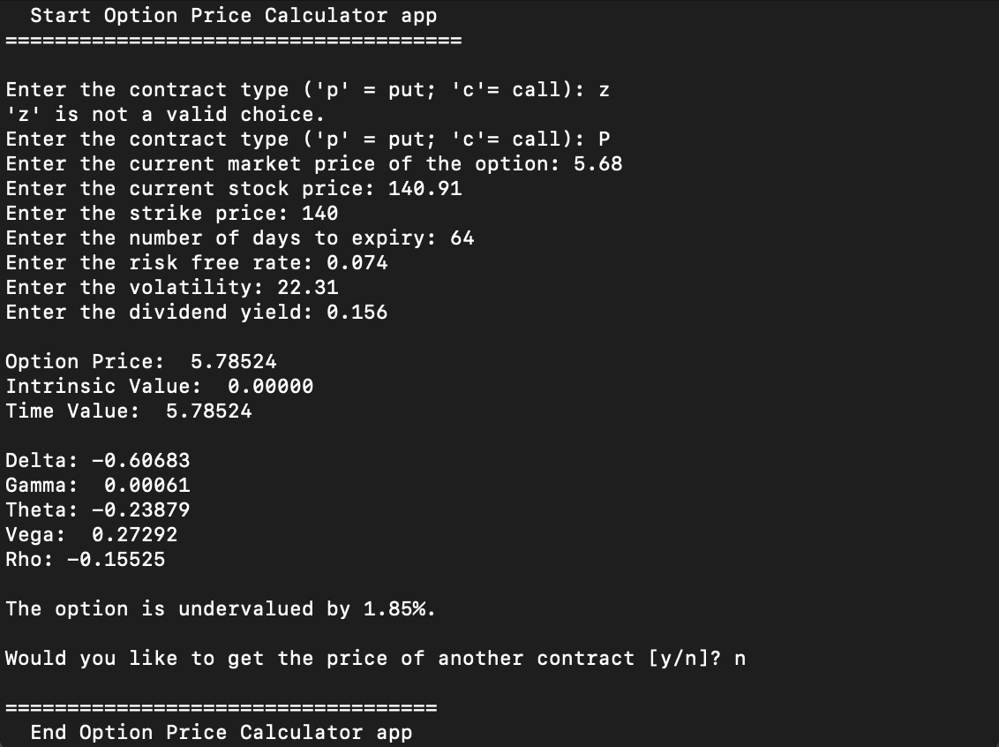

# Option Price Calculator

This a simple console application allowing the user to quickly obtain the price of a European option contract (call/put) along with the option's Greeks.

## Project details

The source code is contained in the options.py file. It contains the class definition used to model European option contracts.

This class contains a single function used to determine the theoritical price of the option, its intrinsic value and its time value using the Black-Scholes formula.

It also returns the calculated option's Greeks (delta, gamma, theta, vega and rho).

The main script collects and validates (using the input validation functions of the PyInputPlus class) user's input and returns the above function's output in an easy to read format. It also indicates whether or not the option is over/under-valued according to the Black-Scholes model.

**Sample output #1**



**Sample output #2**



### How to install the required modules

Run this command on your terminal/command prompt.
```
pip install -r requirements.txt
```
### Next Steps (subject to change)

* ~~Allow the user to enter a ticker and return the desired output directly~~
    * ~~Use Yahoo Finance API to pull the data~~
* ~~Calcultate and display the implied volatility of the contract~~
* [x] Refactor the code to convert the console app to a Flask web app 
* [x] Add HTML to improve user experience
* [x] Deploy the app using Google App Engine 

*Inspired from: https://github.com/hashABCD/opstrat*

